class: inverse, center, middle

# What I Study

```{r setup, include=FALSE}
library(ggplot2)
knitr::opts_chunk$set(fig.width=4.25, fig.height=3.5, fig.retina=3,
                      out.width = "100%",
                      message=FALSE, warning=FALSE, cache = TRUE, 
                      autodep = TRUE, hiline=TRUE)

knitr::opts_hooks$set(fig.callout = function(options) {
  if (options$fig.callout) {
    options$echo <- FALSE
    options$out.height <- "99%"
    options$fig.width <- 16
    options$fig.height <- 8
  }
  options
})

options(
  htmltools.dir.version = FALSE, 
  width = 90,
  max.print = 9999,
  knitr.table.format = "html"
)

as_table <- function(...) knitr::kable(..., format='html', digits = 3)
```

---
layout: false
# What I Study


.left-column[
### .hl[Performance]

]

--

.right-column[
```{r coord-ex, echo=FALSE, out.height = '80%', out.width = '80%'}
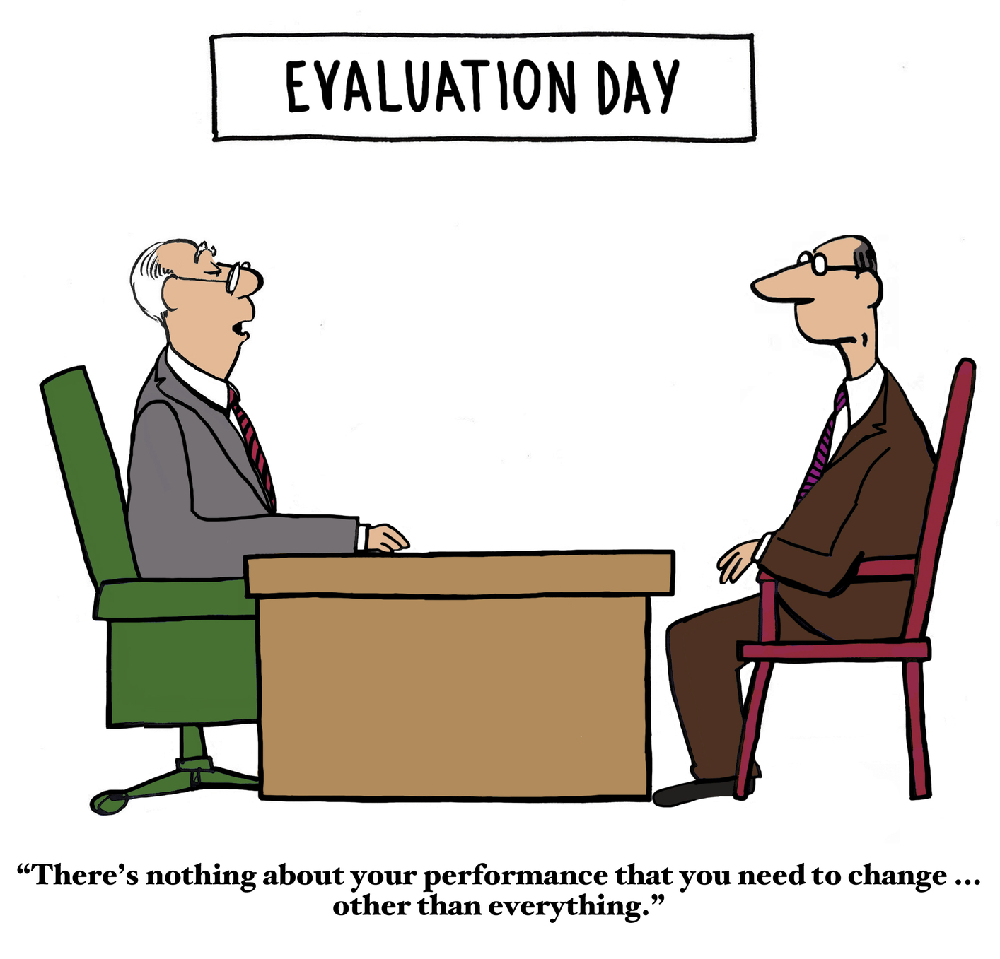
```
]

---

layout: false
# What I Study

.left-column[
### .hl[Performance]
### .hl[Cooperation]

]
.right-column[
```{r diff-ex, echo=FALSE, out.width = '100%'}
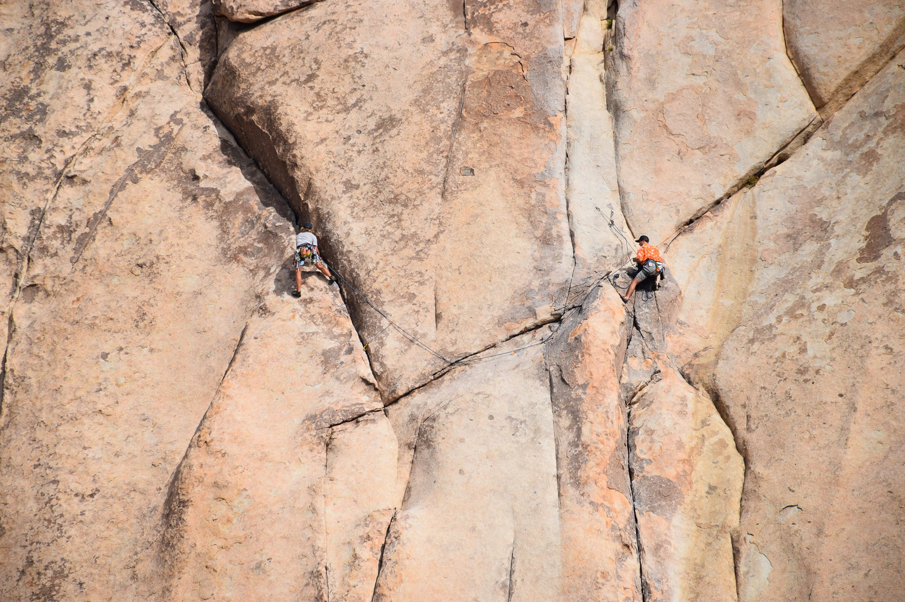
```
]


---

layout: false

# What I Study

.left-column[
### .hl[Performance]
### .hl[Cooperation]

]


```{r another-ex, echo = F, out.width = '75%'}
knitr::include_graphics("images/science.jpg")
```

---

# Today

---

# Today

```{r alright-ex, echo = F, out.width = '100%', fig.align='center'}
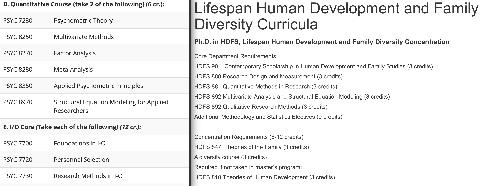
```

---

# Today

.left-column[
### Data Management

### .font200.center[+] 

### General Programming

### .font200.center[=] 

- Productive
- Effective
- Helpful
]
--

.right-column[

- # Your collaborators]
--

.right-column[

- # Your future self]
--

.right-column[

# .hlb[Methods With Others in Mind]]

---
class: inverse, center, middle

# Your Future Self

---
layout: false
# Your Future Self - Understand

--

```{r, echo = F, warning = F, message = F, include = F}

df1 <- data.frame(
  "y" = c(18, 2),
  "method" = c("General Program", "Stats Program")
)

g1 <- ggplot(df1, aes(x = method, y = y)) + 
  #geom_bar(stat = "identity", color = "red") +
  ylab(NULL) + 
  xlab(NULL) +
  theme(axis.text.y = element_blank(),
        axis.ticks = element_blank(),
        axis.text.x = element_text(size = 11, face = "bold")) + 
    scale_y_continuous(limits = c(0, 20))
  
g2 <- ggplot(df1, aes(x = method, y = y)) + 
  geom_bar(stat = "identity", color = "red") +
  ylab(NULL) + 
  xlab(NULL) +
  theme(axis.text.y = element_blank(),
        axis.ticks = element_blank(),
        axis.text.x = element_text(size = 11, face = "bold")) + 
    scale_y_continuous(limits = c(0, 20))

```


## Your Understanding

```{r gplot-ex, echo=F, fig.align = 'center', out.width = '50%', out.height='35%'}
g1
```


---
# Your Future Self - Understand


## Your Understanding

```{r gplot2-ex, echo=F, fig.align = 'center', out.width = '50%', out.height='35%'}
g2
```


---
# Your Future Self - Understand

---
# Your Future Self - Understand

.left-code[

```{r, eval = F}

Performance

```

]
---
# Your Future Self - Understand

.left-code[
```{r, eval = F}
Performance <-  
  simulate_random_walk()
```
]

---
# Your Future Self - Understand

.left-code[
```{r, eval = F}

Performance <- 
  simulate_random_walk(
    time_steps = 55
  )
```

]

---

# Your Future Self - Understand

.left-code[
```{r, eval = F}

Performance <- 
  simulate_random_walk(
    time_steps = 55
  )

```

]

.right-plot[
```{r aplotg, echo = F, fig.width = 7, fig.height = 7}
set.seed(16)
steps <- 55
vals <- cumsum(sample(c(-1,-0.5,0,0.5,1), steps, TRUE))

rw <- data.frame(
  "y" = c(vals),
  'Time' = c(1:steps)
)

gwalk <- ggplot(rw, aes(x = Time, y = y)) + 
  geom_point(color = 'red') + 
  geom_line() + 
  ylab(NULL) + 
  theme(axis.ticks = element_blank(),
        axis.text.y = element_blank(),
        axis.title.x = element_text(size = 14, face = "bold"))

gwalk

```

]

---
# Your Future Self - Understand
---

# Your Future Self - Understand

```{r, eval = F}

Performance[t] <- Performance[t-1]

```

---
# Your Future Self - Understand
```{r, eval = F}

Performance[t] <- Performance[t-1] + noise[t]

```

---
# Your Future Self - Understand

```{r, eval = F}
Performance[t] <- Performance[t-1] + rnorm(1, 0, 1)
```

---
# Your Future Self - Understand

.font200.center[Compare] 

```{r, eval = F}

simulate_process()

```

.font200.center[to]

```{r, eval = F}

variable[t] <- "specify process"

```

---
# Your Future Self - Understand

## .font200.center[.hlb["But I Don't Have Any Data"]]

---
# Your Future Self - Speed
---
# Your Future Self - Speed


---
# Your Future Self - Speed

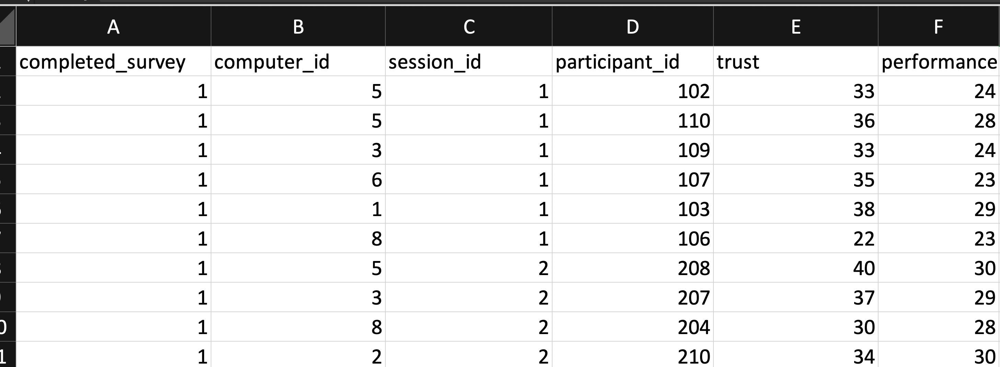

---
# Your Future Self - Speed
---
# Your Future Self - Speed

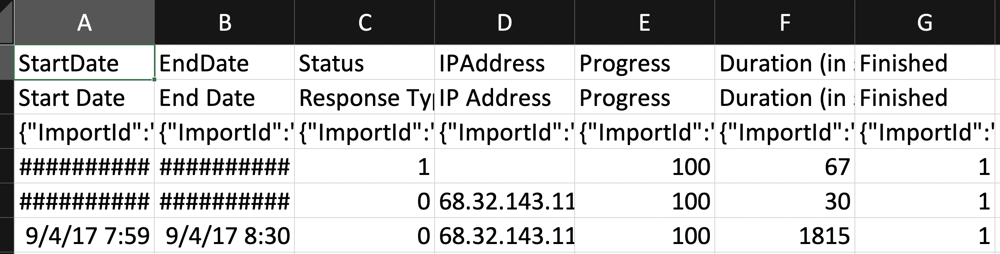

---
# Your Future Self - Speed

---

# Your Future Self - Speed

.right-code[

## cleaning_script.R
```{r, eval = F}

read_data("ugly_qualtrics_df.csv")

select_columns()

filter_rows()

change_names()

```

]

--
.left-code[
```{r, eval = F}

execute(
    "cleaning_script.R"
        )

```

]

---
# Your Future Self - Speed

```{r, echo = F, fig.align = 'center', out.width = '70%', out.height = '70%'}
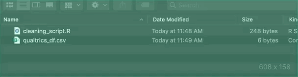
```

---

# Your Future Self - Clarity
---
# Your Future Self - Clarity

### .font200.center[College Student Career Interests Project]

```{r, echo = F, fig.align = 'center', out.width = '60%', out.height = '60%'}
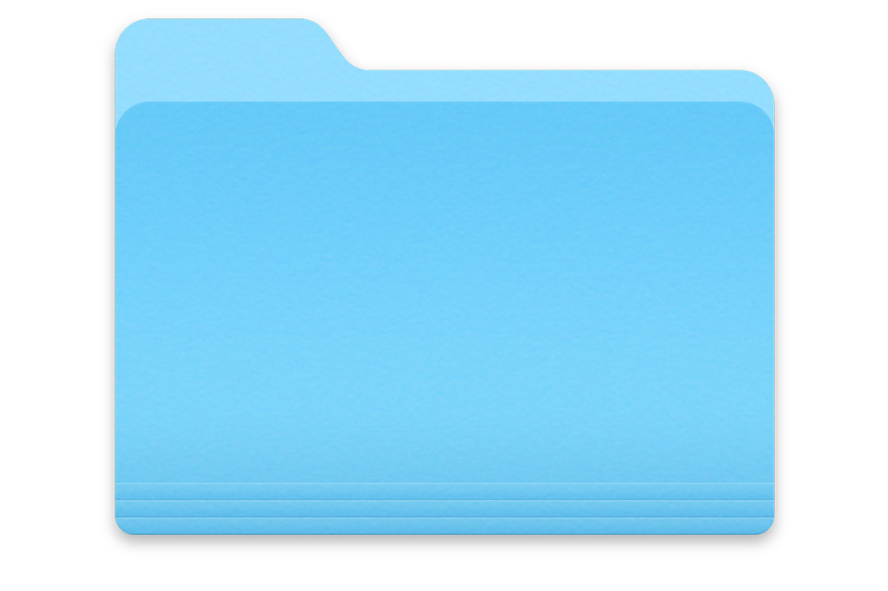
```

---
# Your Future Self - Clarity

### .font200.center[College Student Career Interests Project]

```{r, echo = F, fig.align = 'center', out.width = '70%', out.height = '70%'}
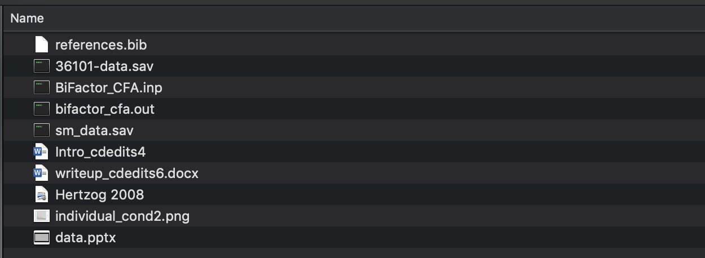
```


---
# Your Future Self - Clarity

### .font200.center[College Student Career Interests Project]

```{r, echo = F, fig.align = 'center', out.width = '60%', out.height = '60%'}
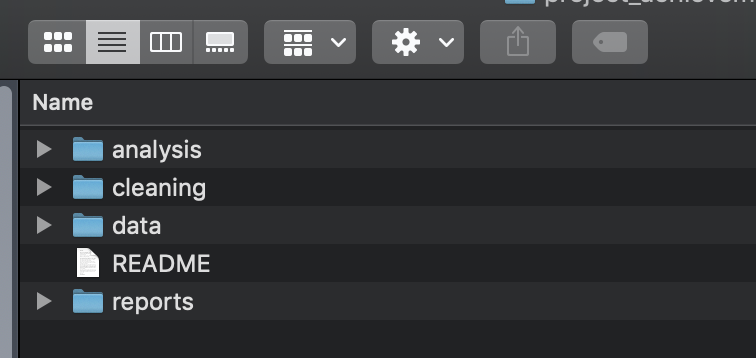
```

---
# Your Future Self - Clarity


```{r, echo = F, fig.align = 'center', out.width = '30%', out.height = '30%'}
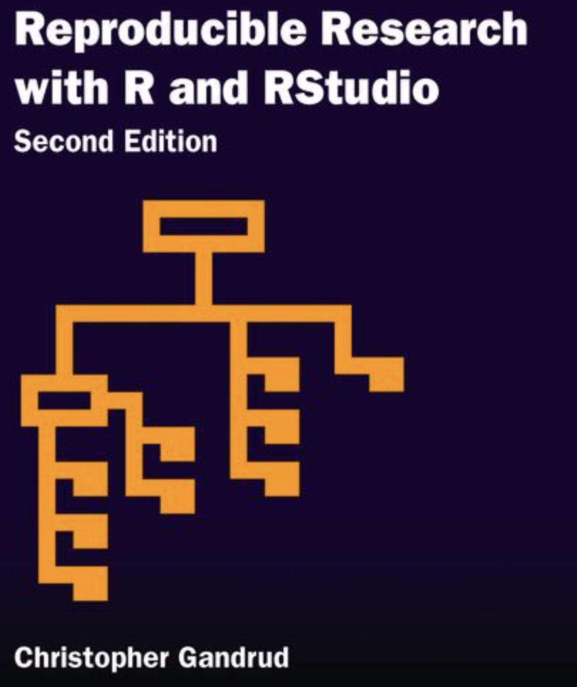
```

.footnote[Christopher Gandrud, 2013. <https://www.amazon.com/Reproducible-Research-Studio-Chapman-Hall/dp/1466572841>]

---
layout: false
# Methods With Others In Mind - Your Future Self

--

.font200.center[**Understand**]

--
.font200.center[**Speed**]

--
.font200.center[**Clarity**]

---
class: inverse, center, middle

# Your Collaborators

---


```{r, echo = F, fig.align = 'center', out.width = '70%', out.height = '70%'}
knitr::include_graphics("images/network.gif")
```

---
# Your Collaborators - Execute
---
# Your Collaborators - Execute


```{r, echo = F, out.width = '33%'}
knitr::include_graphics(rep(c("images/usd.jpg",
                              "images/depaul.jpeg",
                              "images/australia.jpg"), 1))
```

--

<br>
<br>
.font200.center[Data]

.font200.center[Code]

---
# Your Collaborators - Execute

--

.font200.center[.hlb[analysis.dat]]

--

<br>

<br>

<br>

<br>

<br>


```{r, eval = F}

read_data("/Users/christopherdishop/Desktop/project/mplus_data.csv")

# rest of the code...

```

---
# Your Collaborators - Execute

```{r, echo = F, fig.align = 'center', out.width = '60%', out.height='60%'}

```


<br>

```{r, eval = F}

read_data("/Users/christopherdishop/Desktop/project/mplus_data.csv")

# rest of the code...

```

---
# Your Collaborators - Execute

```{r, echo = F, fig.align = 'center', out.width = '60%', out.height='60%'}

```


<br>

```{r, eval = F}

read_data("/Users/christopherdishop/Desktop/project/mplus_data.csv")

# rest of the code...

```


---
# Your Collaborators - Execute

.font200.center[.hlb[analysis.dat]]


<br>

.font200.center[Not with others in mind...]

```{r, eval = F}
read_data("/Users/christopherdishop/Desktop/project/mplus_data.csv")
```

--

.font200.center[With others in mind...]

```{r, eval = F}

read_data("../data/mplus_data.csv")

# rest of the code...

```

---
# Your Collaborators - Execute

```{r, echo = F, fig.align = 'center', out.width = '60%', out.height='60%'}

```

<br>

```{r, eval = F}

read_data("../data/mplus_data.csv")

# rest of the code...

```

---
# Your Collaborators - Learn

--

.left-column[


]

.img-right[]


---
# Your Collaborators - Learn

.font200.center[.hlb[Markdown!]]

--
```{r, echo = F, fig.align = 'center', out.width = '70%', out.height = '70%'}

```

---
class: inverse, center, middle

# Methods With Others in Mind

---

# Methods With Others in Mind

## Data management and programming to cooperate with .hl[others]...

--

.font200.center[.hlb[Your future self]]

--
<br>

<br>

<br>

.font200.center[.hlb[Your collaborators]]

---

# Methods With Others in Mind

## Data management and programming to cooperate with .hl[others]...


.font200.center[.hlb[Your future self]]

.font120.center[Understand]
.font120.center[Speed]
.font120.center[Clarity]

.font200.center[.hlb[Your collaborators]]

.font120.center[Execute]
.font120.center[Learn]

---

# Methods With Others in Mind
```{r, echo = F, fig.align = 'center', out.width = '30%', out.height='30%'}
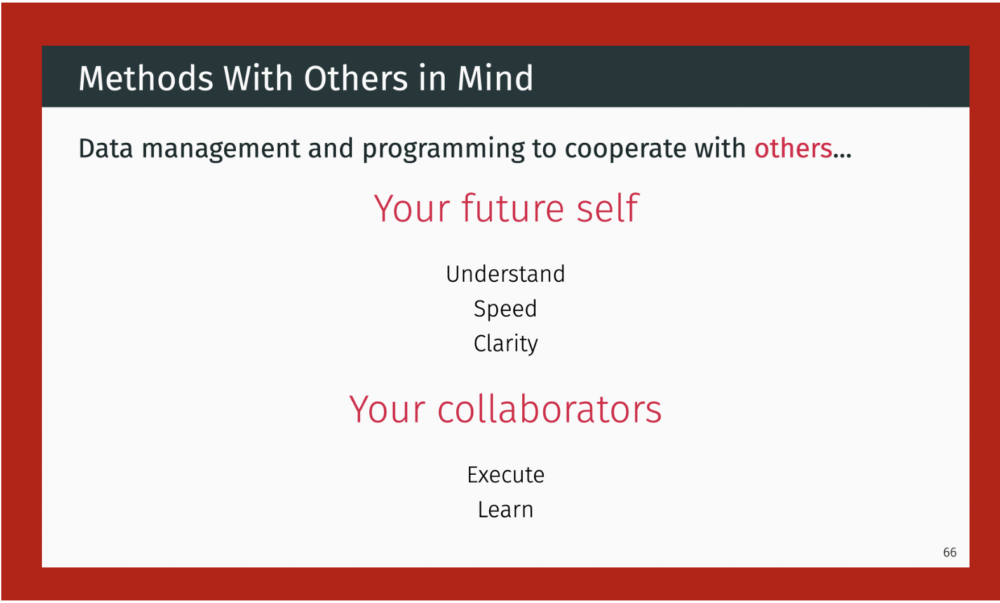
```

---
# Methods With Others in Mind
```{r, echo = F, fig.align = 'center', out.width = '100%', out.height='100%'}
knitr::include_graphics("images/universe.png")
```


---
class: inverse, center, middle

# Thanks!
<br>
# Questions?
